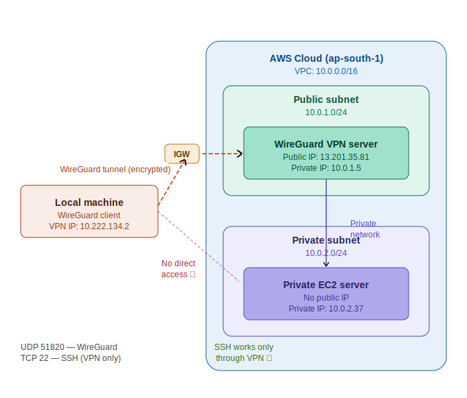

# 🔐 AWS WireGuard Private SSH Lab

A production-style secure access architecture built with Terraform where a private EC2 instance has **NO public IP** and is accessible **only through WireGuard VPN**.

---

## 🏗️ Architecture



```
Local Machine
     ↓
WireGuard VPN Tunnel (Encrypted)
     ↓
AWS VPN Server (Public Subnet - 10.0.1.0/24)
     ↓
Private AWS Network
     ↓
Private EC2 Server (No Public IP - 10.0.2.0/24)
```

---

## 🛠️ Technologies Used

| Component | Technology |
|---|---|
| Cloud | AWS (ap-south-1) |
| VPN | WireGuard |
| OS | Ubuntu 22.04 |
| IaC | Terraform |
| Networking | VPC / Subnets / IGW / Route Tables |
| Security | Security Groups |
| CI/CD | GitHub Actions |

---

## 📁 Project Structure

```
terraform/
├── provider.tf          # AWS provider config
├── variable.tf          # Input variables
├── vpc.tf               # VPC, Subnets, IGW, Route Tables
├── security_groups.tf   # Firewall rules
├── ec2.tf               # VPN Server + Private Server
├── output.tf            # Important outputs
└── .github/
    └── workflows/
        └── terraform.yml  # GitHub Actions CI/CD
```

---

## 🔒 Security Design

### VPN Server Security Group
| Protocol | Port | Source |
|---|---|---|
| UDP | 51820 | 0.0.0.0/0 (WireGuard) |
| TCP | 22 | Your IP only |

### Private Server Security Group
| Protocol | Port | Source |
|---|---|---|
| TCP | 22 | 10.0.1.0/24 (VPN Server only) |
| ICMP | All | 10.0.1.0/24 (VPN Server only) |

---

## 🚀 How to Deploy

### Prerequisites
- AWS Account
- Terraform installed
- AWS CLI configured
- Key Pair created in AWS

### Steps

**1. Clone the repo**
```bash
git clone https://github.com/Sahilx987/Wireguard-vpn-setup.git
cd Wireguard-vpn-setup/terraform
```

**2. Create terraform.tfvars**
```hcl
aws_region    = "ap-south-1"
my_public_ip  = "YOUR_IP/32"
key_pair_name = "your-key-name"
```

**3. Deploy**
```bash
terraform init
terraform plan
terraform apply
```

---

## 🔧 WireGuard Setup

**Install on VPN Server:**
```bash
curl -L https://install.pivpn.io | bash
```

**Create client config:**
```bash
pivpn add
```

**Connect from local machine:**
```bash
sudo wg-quick up wg0
```

**Verify tunnel:**
```bash
sudo wg show
```

---

## ✅ Testing

```bash
# Ping VPN Server
ping 10.222.134.1

# Ping Private EC2
ping 10.0.2.37

# SSH to Private EC2 (only works through VPN!)
ssh -i "key.pem" ubuntu@10.0.2.37
```

---

## 🔄 GitHub Actions CI/CD

On every push to `main`:
- ✅ Terraform Init
- ✅ Terraform Plan

Secrets required:
- `AWS_ACCESS_KEY_ID`
- `AWS_SECRET_ACCESS_KEY`

---

## 📚 Concepts Demonstrated

- VPN fundamentals
- Private networking
- Secure remote administration
- Infrastructure as Code (Terraform)
- CI/CD with GitHub Actions
- AWS Security Groups
- Public vs Private subnet design
- SSH hardening

---

## 👨‍💻 Author

**Sahil** — DevOps Engineer  
[GitHub](https://github.com/Sahilx987) | [LinkedIn](https://linkedin.com/in/YOUR_LINKEDIN)
